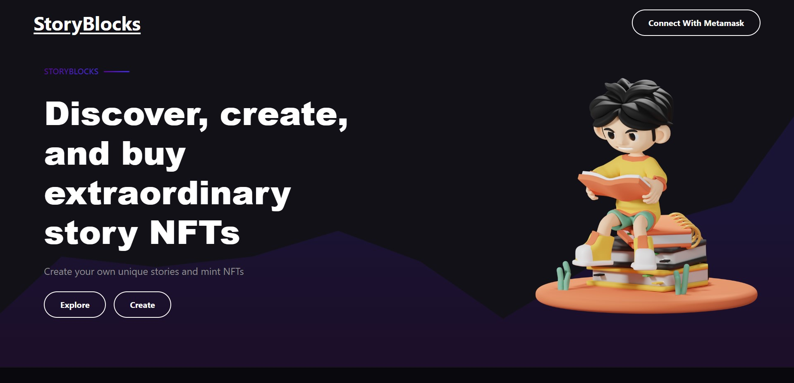
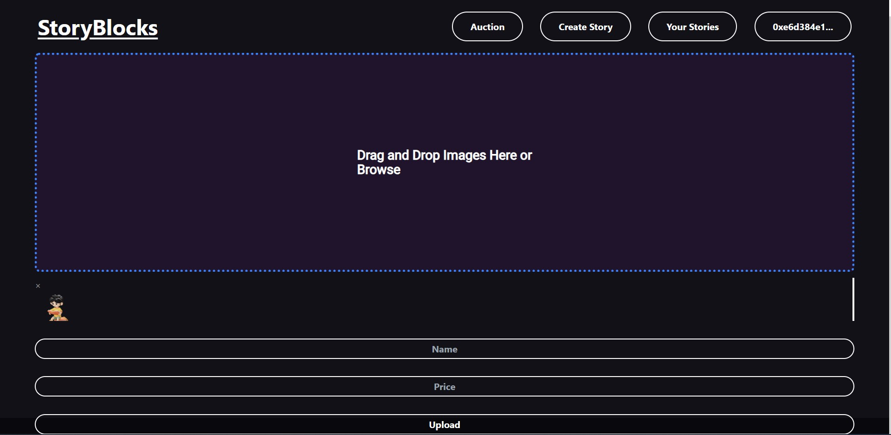
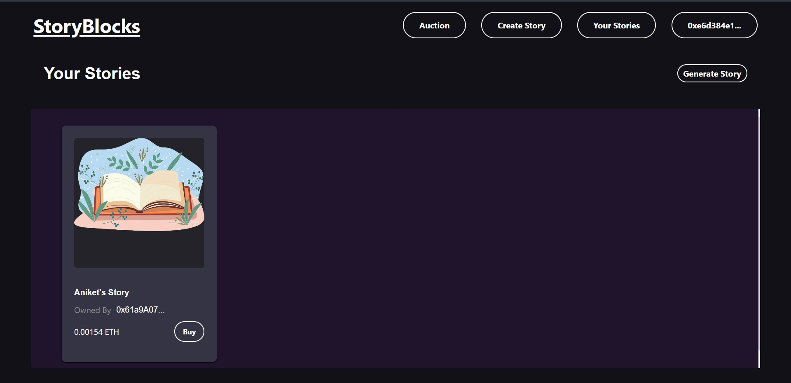
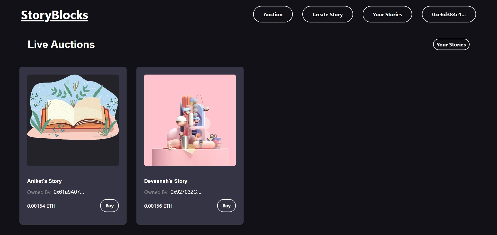

# StoryBlocks



## Overview

Storybook Platform is a decentralized application (DApp) built on Arbitrum and Scroll, offering a platform for users to create and share their digital storybooks securely on the blockchain.

## Features

- **User-friendly Interface:** Easily create and manage your digital storybooks.
- **Decentralized Storage:** Leverage the power of Filecoin and IPFS for secure and distributed storage.
- **Interoperability:** Deployed on both Arbitrum and Scroll, providing flexibility for users.

## Screenshots





## Live Demo

Explore our project live on the Arbitrum Sepolia and Scroll Sepolia testnets:

### Arbitrum Deployment
Contract address
```
0x42437974Bc49D153a8F6a9C1519042554b430763
```
https://sepolia.arbiscan.io/tx/0x517acfcd9c65e4b4999e44967e2cbbb8825f358c07ff432a383c3d07f86ddefd

### Scroll Deployment
Contract address
```
0xA62Bf167eb48a2c22604ad4817D04d05254A142f
```
https://sepolia-blockscout.scroll.io/tx/0x1f9bab55d1223b1d766160cbab8a445a5c3e52df9ee9564747a92ce342b8133d

## Technologies Used

- Ethereum
- Arbitrum
- Scroll
- IPFS
- Filecoin

## Getting Started

Follow these steps to run the project locally:

```bash
# Clone the repository
git clone https://github.com/aniketp02/EtherTales

# Navigate to the project directory
cd EtherTales

# Install dependencies
npm install

# Run the project
npm start
